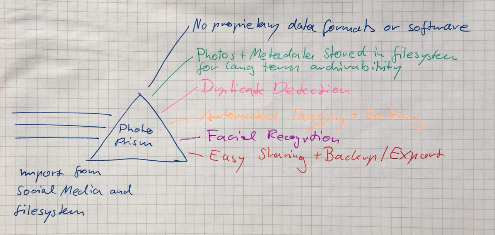

PhotoPrism: Digital Photo Archive
=================================

[][ci]
[][code quality]
[][issues]
[][license]

[ci]: https://travis-ci.org/photoprism/photoprism
[code quality]: https://goreportcard.com/report/github.com/photoprism/photoprism
[issues]: https://github.com/photoprism/photoprism/issues
[license]: https://github.com/photoprism/photoprism/blob/master/LICENSE

PhotoPrism is a free tool for importing, filtering and archiving large amounts of
JPEG and RAW files. Originals, thumbnails and metadata are stored in the file system for easy
backup and reliable long-term accessibility.

Setup
-----
Before you start, make sure you got Git and Docker installed on your system.
Instead of using Docker, you can also setup your own runtime environment
based on the existing Docker configuration.

**Step 1:** Run [Git](https://getcomposer.org/) to clone this project:

```
git clone git@github.com:photoprism/photoprism.git
```

**Step 2:** Start [Docker](https://www.docker.com/) containers:

```
cd photoprism
docker-compose up
```

*Note: This docker-compose configuration is for testing and development purposes only.*

**Step 3:** Open a terminal to run commands and unit tests:

```
docker-compose exec photoprism bash
dep ensure
go test
go build cmd/photoprism/photoprism.go
./photoprism
```

About
-----

**Note: This software is still alpha and under active development.
You're welcome to join our team.**

Our goal is to provide the following features (tested as a proof-of-concept):

- High-performance command line tool
- Web frontend
- No proprietary or binary data formats
- Duplicate detection
- Automated tagging using Google TensorFlow
- Image search with powerful filters
- Easy backup and export


